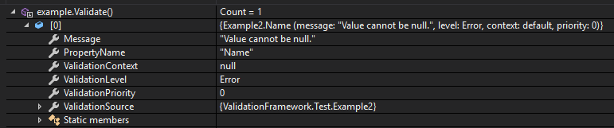
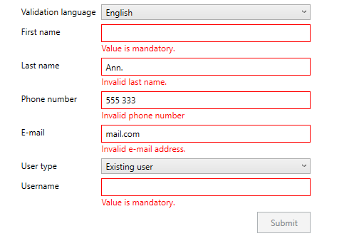
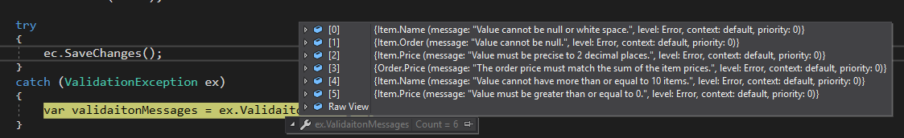

# Validation Framework for .NET Framework
Validating object state can be difficult to do correctly, but failing to do so can cause be a cause many different types of issues: invalid data being stored in the database, users being allowed to do perform actions they  weren't supposed to, applications getting into an invalid state, etc.
This is where Validation Framework comes in. It allows programmers to validate objects in a simple and extensible way to validate the state of their objects. 

## Validation

Object can be validated partially by validating the value a specific property or as a whole by validating the values of all its properties.

### How to use the Validation Framework

When using the Validation Framework for object validation the programmer has two options of including the validation functionality:

 - By inheriting from the Validatable class :
 ```csharp
using ValidationFramework;

public class Example : Validatable
{
}
```

 - Sometimes you might not have the option of inheriting from a certain class. In such a case, you can implement the IValidatable interface:
 
 ```csharp
using ValidationFramework;

public class Example : IValidatable
{
	public virtual IEnumerable<string> GetActiveValidationContexts()
	{
		return Array.Empty<string>();
	}

	public virtual ValidationMessageCollection Validate(string propertyName, object propertyValue, string validationContext)
	{
		return ValidatableExtensions.ValidateAttributes(this, propertyName, propertyValue, validationContext);
	}
}
```

Make sure that GetActiveValidationContexts() and Validate() methods are marked as virtual if you are creating a validatable base class, so you can override them in sub-classes!
By choosing either of the two options and with the help of extension methods, you can do the following:

 ```csharp
Example example;

example = new Example();
bool isObjectValid = example.IsValid();
var objectValidationMessages = example.Validate();
bool isPropertyValid = example.IsValid(nameof(example.Name));
var propertyValidationMessages = example.Validate(nameof(example.Name));
```

### Validation attributes

The easiest way of validating properties is by using validation attributes:
 ```csharp
public class Example : Validatable
{
    [MustMatch(@"^[\w ]+$")]
	[CannotBeLongerThan(20)]
    [CannotBeNullOrEmpty()]
	public string Name
	{
		get;
		set;
	}
}
```
The example above validates that value of property Name:

 - cannot be null or empty,
 - cannot be longer than 20 characters and
 - match the specified regular expression (only word characters and spaces).

How to perform validation:

 ```csharp
Example example;
bool isValid;
ValidationMessageCollection validationMesasges;

example = new Example();
example.Name = "Test";
isValid = example.IsValid(); // isValid == true
isValid = example.IsValid(nameof(example.Name)); // isValid == true
validationMessages = example.Validate(); // validationMessages.Count == 0
validationMessages = example.Validate(nameof(example.Name)); // validationMessages.Count == 0

example.Name = null;
isValid = example.IsValid(); // isValid == false
isValid = example.IsValid(nameof(example.Name)); // isValid == false
validationMessages = example.Validate(); // validationMessages.Count == 1
validationMessages = example.Validate(nameof(example.Name)); // validationMessages.Count == 1
validationMessages.First().Messge; // "Value cannot be null or empty."
validationMessages.First().PropertyName; // "Name"
```



Validation framework contains a large number to help you easily set validation conditions on properties. For example:

 - CannotBeNull (demanding the value is not equal to null),
 - CannotBeNullOrEmpty (demanding the value is not null or empty),
 - MustBeOneOf (demanding the value belongs to the specified set of values),
 - MustBeGreaterThan (demanding the value is greater than the specified limit),
 - CannotBeLongerThan (demanding the value is not longer than the specified limit),
 - CannotContainDuplicates (demanding the value does not contain duplicates),
 - CannotContainNull (demanding the value does not contain null),
 - MustBeValidFilePath (demanding the value is a valid file path),
 - MustMatch (demanding the value matches the specified regular expression),
 - MustBeValidUri (demanding the value is a valid URI),
 - MustBeUpperCase (demanding the value is an uppercase string)

and many more. See the source code for a complete list. 

Using validation attributes is simple and requires little code to write, keeping your classes short and easy to understand. Making your own custom validation attributes is easy to do (see section on extending Validation Framework).
Not all validation attributes can be used with all property types. For example using MustMatch attribute on an integer property makes no sense and will throw a ValidationErrorException:
 ```csharp
public class Example : Validatable
{
    [MustMatch(@"^[\w ]+$")]
	public int Length
	{
		get;
		set;
	}
}

Example example;

example = new Example();
example.Length = 2;

try
{
    example.Validate();
}
catch (ValidationErrorException ex)
{
   // ex.Message == "Unhandeled validation exception occured."
   // ex.InnerException.Message == "Value must be of type String."
}
```
All validation attributes check if value type is compatible with their validation procedure.

### Custom validation

Sometimes using attributes is not flexible enough for all scenarios. In that case you have the option of performing validation within the Validate() method:
 ```csharp
public override ValidationMessageCollection Validate(string propertyName, object value, string validationContext)
{
		ValidationMesageCollection messages = base.Validate(propertyName, value, validationContext);

	if (propertyName == nameof(this.Name))
	{
			if ((value as string).Trim() != (value as string))
			{
				messages.Add(new ValidationMessge("CannotContainTrailingSpaces", "Value cannot contain trailing spaces.", Array.Empty<object>(), this, propertyName));
			}
	}

	return messages;
}
```
Make sure you call the base.Validate(...) method at the beginning of the method; otherwise attribute validation will be skipped!

### Validation messages

The result of validation is a collection of validation messages. If the object or property is valid, the validation message collection will contain no items. However if the object or property is invalid, the validation message collection will contain items describing validation issues.

A validation message contains the following properties:

 - ValidationSource: the reference to the object being validated,
 - ValdationLevel: describing the severity of the validation issue (None, Info, Warning or Error)
 - PropertyName: the name of the property, belonging to validation source that the message relates to,
 - Message: the description of the validation issue,
 - ValidationContext: the name of the validation context (see section on validation contexts) and
 - ValidationPriority: the validation priority (see section on validation priorities).

#### Merging validation messages
Sometimes you want to present only a single validation message by selecting the message with the highest validation level and highest validation priority. A collection of validation messages can be merged in the following way:
 ```csharp
var mergedValidationMessage = validationMessages.Merge();
```

### Validation context

Sometimes you want the validation  attributes to be executed only  in certain cases. This is where validation context comes in. The default validation context is always used (ValidationContext.Default), which has actually null as a value. But let's say, you want to use a validation only if the object has not yet been saved to the database:
 ```csharp
public class Example : Validatable
{
		public int Id
		{
			get;
			set;
		}
		
		[CannotBeNull()]
		public DateTime? Created
		{
			get;
			set;
		}
		        
		[CannotBeNull(ValidationContext = "existing")]
		public DateTime? Modified
		{
			get;
			set;
		}
		
      public override IEnumerable<string> GetActiveValidationContexts()
      {
          if (this.Id == -1)
          {
              return new string[] { "new" };
          }
          else
          {
              return new string[] { "existing" };
          }
      }
}
```

In this case property Created must always present, but property Modified must have a value only when property Id > 0. Default validation context will always be validated, but you have the option of adding as many different active validation contexts as needed that change according to the internal state of the object by overriding the GetActiveValidationContexts() method.
 
### Validation priority
Sometimes you have multiple validation rules that can be invalid at the same time:
```csharp
[MustMatch("^[0-9]+$")]
[CannotBeLongerThan(10)]
[CannotBeNull()]
public DateTime? Name
{
	get;
	set;
}
```
For example:
```csharp
example.Name = "aaaaaaaaaaaaaaaaaaaaaaaaa";

var validationMessages = example.Validate(nameof(example.Name));
// validationMessages.Count == 2
// validationMessages[0].Message == "Value must match ^[0-9]+$."
// validationMessages[1].Message == "Value cannot be longer than 10 items."
```
In such a case you might want only one rule to be active at a time. This is where you can use validation priority to specify the order of rules being evaluated. Highest validation priority starts with 0 (default validation priority) and decreases with incrementation.
```csharp
[MustMatch("^[0-9]+$", ValidationPriority = 2)]
[CannotBeLongerThan(10, ValidationPriority = 1)]
[CannotBeNull(ValidationPriority = 0)]
public DateTime? Name
{
	get;
	set;
}
```

In this case there will be only one validation message caused by the [CannotBeLongerThan] attribute, since it has a higher priority than the [MustMatch] attribute:

```csharp
example.Name = "aaaaaaaaaaaaaaaaaaaaaaaaa";

var validationMessages = example.Validate(nameof(example.Name));
// validationMessages.Count == 1
// validationMessages[0].Message == "Value cannot be longer than 10 items."
```

### Custom validation messages

Every validation attribute has a default validation message provided by the validation attribute, however you do have the option of assigning a custom one:
```csharp
[CannotBeNullOrWhitespace(Message = "Value is mandatory.")]
public string Name
{
	get;
	set;
}
```

### Localization

Every validation attribute has a MessageKey property that you can use to localize messages. First you must assign a delegate to ValidationMessage for getting localized messages for the specified message key. You can use a ResourceManager, a dictionary or whatever else you want: 

```csharp
ValidationMessage.GetLocalizedMessage = messageKey => new ResourceManager(this.GetType()).GetString(messageKey);
```

Make sure you do this before you start performing validations. If a message for the message key is not found, the default validation message provided by validation attribute will be used.
```csharp
// set custom message key
[CannotBeNull(MessageKey = "ValueIsMandatory")]
public string Name
{
	get;
	set;
}
```
As a template for generating your own translation file, use the English one that comes in with the source code (Source/ValidationFramework/Localization/ValdationMessages.resx).

## Examples

### Using the Validation Framework with WPF



See project ValidationFramework.Examples.Wpf in the source code for details.

Things to note:

 - You need to u the default appearance of input controls to provide a way of displaying errors to the user (see App.xaml on how to do so).
 - The example uses ReactiveUI, but that is not necessary for using ValidationFramework.
 - The example shows how to 	implement interface IDataErrorInfo used by WPF to query for errors when setting a property value.
 - ReactiveUI bindings do not provide a simple way of including validations, that is why it's recommended to stick with default WPF bindings. Be sure to set property ValidatesOnDataErrors = true on bindings. The example sets th bindings in code, but you can do the same thing in XAML.
 - The example shows how to implement the option of suppressing validation on demand, so the user is presented with the errors only after the first submit attempt. 
 - The example shows how to use message localization in practice.

### Using with EntityFramework



See project ValidationFramework.Examples.Ef in the source code for details.

## Extending the Validation Framework
If you need a custom validation attribute, you can implement your own. It is easy to do:
```csharp
[AttributeUsage(AttributeTargets.Property, AllowMultiple = false, Inherited = false)]
public sealed class MustBeTrimmedAttribute : ValidationAttribute
{
    public override string GetDefaultMessage()
    {
        return "Value must be without leading or trailing spaces.";
    }

    public override string GetDefaultMessageKey()
    {
        return "MustBeTrimmed";
    }

    public override bool IsValid(object value)
    {
        if (value == null ||
            value == DBNull.Value)
        {
            // null values are ok, they should be prevented with a [CannotBeNull] attribute
            return true;
        }
        else
        {
            // make sure the value is a string
            value.MustBeTypeOf(typeof(string));

            // the actual value vlidation
            return string.Compare(value as string, (value as string).Trim()) == 0;
        }
    }
} 
```

Instructions:

 - Make sure you derive from the ValidationAttribute class.
 - Make sure you use the AttributeUsage attribute. Just copy it from  the example.
 - Implement the default message describing the validation violation.
 - Implement the default message key, that can be used for message localization.
 - Generally null values are validated as valid (same goes for DBNull). If you need to constrain your property to contain an actual value, add the CannotBeNull attribute.
 - When expecting a value of a specific type, make sure you validate the value type.

Using the custom attribute:
```csharp
[MustBeTrimmed()]
public string Name
{
	get;
	set;
}
```

Sometimes you need to provide the attribute with additional parameters:
```csharp
[AttributeUsage(AttributeTargets.Property, AllowMultiple = false, Inherited = false)]
public sealed class CannotContainValuesLessThanOrEqualToAttribute : ValidationAttribute
{
    public CannotContainValuesLessThanOrEqualToAttribute(int minValue)
    {
        this.MinValue = minValue;
    }

    private CannotContainValuesLessThanOrEqualToAttribute()
    {
    }

    public int MinValue
    {
        get;
    }

    public override string GetDefaultMessage()
    {
        return "Value cannot contain values less than or equal to {0}.";
    }

    public override string GetDefaultMessageKey()
    {
        return "CannotContainValuesLessThanOrEqualTo";
    }

    public override bool IsValid(object value)
    {
        if (value == null ||
            value == DBNull.Value)
        {
            return true;
        }
        else
        {
            value.MustBeTypeOf(typeof(IEnumerable<int>));

            return !(value as IEnumerable<int>).Any(x => x <= this.MinValue);
        }
    }

    protected override IEnumerable<object> GetParameters()
    {
        return new object[] { this.MinValue };
    }
}
```

Instructions:
 - Make the default constructor private in order to force the user to provide the constraint by using the overloaded constructor.
 - Make sure you include a placeholder in the default message and not include the actual constraint value in the default value, because that will make localization difficult.
 - override GetParameters() method, where you provide the constraint values in the exact order as listed in the default message.
 
Using the custom attribute:
```csharp
[CannotContainValuesLessThanOrEqualTo(5)]
public IEnumerable<int> Numbers
{
	get;
	set;
}
```

After you've created a custom attribute, you can use it as many times as you want. If your attribute throws an exception during validation for whatever reason, a ValidationErrorException will be thrown during invocation of of the IsValid() or Validate() methods, containing the original exception in its InnerException property, making it easier for your to debug.

# Installation

Run the following command in your Package Manager Console in Visual Studio:

```csharp
Install-Package ValidationFramework 
```

Or just simply search for ValdationFramework in NuGet package manager in Visual Studio.

## Guidelines

 - Validation Framework can be used in different environments, like console applications, web applications, desktop applications, mobile applications or class libraries. You can use it to validate user input, request payloads, configuration, etc. It is flexible, but does not constrain you.
 - Implement custom validation attributes whenever you can. They will make your code short, clean and reusable.
 - When you need to perform validation whose result depends on value of more than one property, do so by overriding the Validate() method. That cannot be done with a validation attribute.
 - Validation Framework is not thread safe.
 - In order to prevent executing an operation on an invalid object your cant throw a ValidationException (see EF example code).

